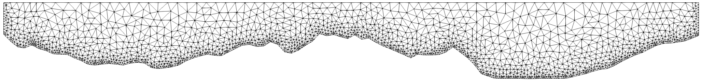
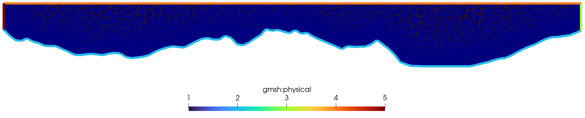

# Simple notebook project to create height profile between two points

## Usage

### Basic
- First create a height profile using GeoMeshGen.ipynb
- Based thereupon, create a triangle mesh using Surface_mesh.ipynb

The result will be a mesh like

Bulk and surface meshes can be extracted from gmsh physical groups

### User Input
- To create different height profiles, adjust lat/lon start and end points in GeoMeshGen.ipynb
- To vary cell growth away from the boundary, modify `_needs_refinement()` in SurfaceMesh.ipynb
- To alter max cell area, adjust the argument to `create_mesh()` in SurfaceMesh.ipynb
- To mesh a large altitude, adjust `hmax` in GeoMeshGen.ipynb
